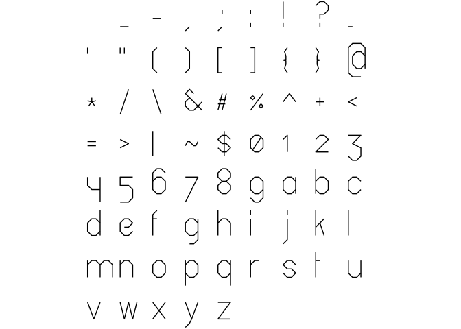
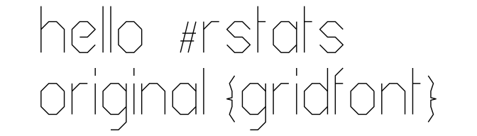
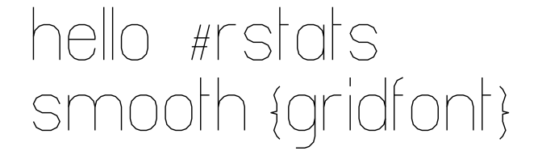

<!-- README.md is generated from README.Rmd. Please edit that file -->

# gridfont

<!-- badges: start -->


<!-- badges: end -->

An R repackaging of [gridfont](https://github.com/inconvergent/gridfont)
a vector font created by
[inconvergent](https://twitter.com/inconvergent)

This is similar to the packages
[hershey](https://github.com/coolbutuseless/hershey) and
[arcadefont](https://github.com/coolbutuseless/arcadefont) in that it
provides point and stroke information, but how this is actually rendered
is up to you.

In the examples below `ggplot` is used to render the strokes for each
glyphs as `geom_path` objects.

#### What’s in the box?

  - `original_df` - a data.frame of coordinates and stroke information
    for all the provided glyphs for the **original** version of the
    font.
  - `smooth_df` - a data.frame of coordinates and stroke information for
    all the provided glyphs for the **smooth** version of the font.
  - `create_text_df()` - a function to create stroke information for all
    the characters in a given string, and offset them appropriately
    (vertically and horizontally) so that they are ready to render.
  - `original_json`, `smooth_json` the original JSON data read in using
    `jsonlite` and provided as list objects.

#### Installation

You can install from
[github](https://github.com/coolbutuseless/gridfont) with:

``` r
# install.packages('remotes')
remotes::install_github("coolbutuseless/gridfont")
```

#### License

This package is made available under the MIT license. See the file
“LICENCSE”.

The original font data was made available by Anders Hoff (a.k.a
Inconvergent) also under the MIT license. See the file “LICENSE-font”

## Sample sheet for the ‘original’ font

``` r
ggplot(gridfont::original_df, aes(x, y)) +
  geom_path(aes(group = as.factor(stroke)), na.rm=TRUE) +
  coord_equal() +
  theme_void() + 
  facet_wrap(~char)  + 
  theme(
    strip.background = element_blank(),
    strip.text.x     = element_blank()
  )
```



## Sample sheet for the ‘smooth’ font

``` r
ggplot(gridfont::smooth_df, aes(x, y)) +
  # geom_point() +
  geom_path(aes(group = as.factor(stroke)), na.rm=TRUE) +
  coord_equal() +
  theme_void() + 
  facet_wrap(~char)  + 
  theme(
    strip.background = element_blank(),
    strip.text.x     = element_blank()
  )
```


## Creating blocks of text

`gridfont` includes `create_text_df()` as an easy way to create stroke
data for all the characters from a given string.

``` r
text    <- 'hello  #RStats\noriginal {gridfont}'
plot_df <- create_text_df(text, font='original')

ggplot(plot_df, aes(x, y)) +
  geom_path(aes(group = interaction(char_idx, stroke)), na.rm=TRUE) +
  coord_equal() +
  theme_void()
```



``` r
text    <- 'hello  #RStats\nsmooth {gridfont}'
plot_df <- create_text_df(text, font='smooth')

ggplot(plot_df, aes(x, y)) +
  geom_path(aes(group = interaction(char_idx, stroke)), na.rm=TRUE) +
  coord_equal() +
  theme_void()
```



## Animated rendering

Now that all the stroke information is available, we can render each
stroke, character-by-character to get a “writing” effect.


